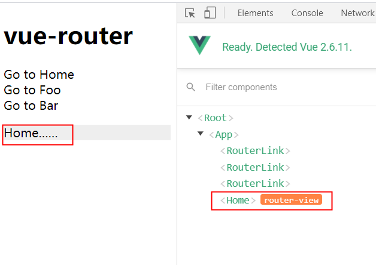
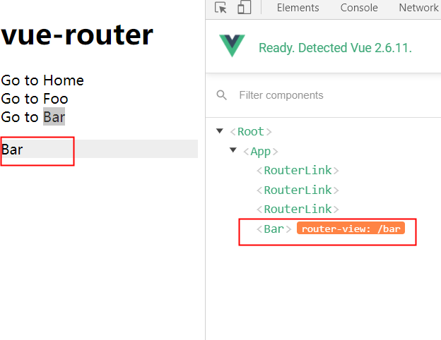
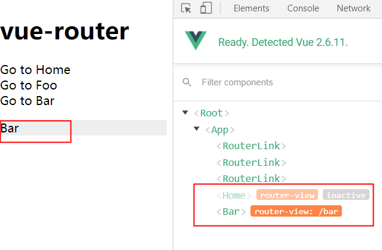

# router-view 缓存
完整代码分支 [stage-5](https://github.com/shengrongchun/parse-vue-router)
熟悉 `vue` 的都知道我们可以通过 `keep-alive` 来缓存 `router-view` 如：
```html
<keep-alive>
  <router-view></router-view>
</keep-alive>
```
那么 `keep-alive` 到底是怎么做到缓存的呢？我并不会从代码角度去解析，如果有兴趣可以自行研究 `keep-alive` 源码。我们从例子角度来观察：

假设我们有组件 `Home Bar` 组件，用 `keep-alive` 包裹和不包裹在 `vue-devtools` 中是有什么渲染区别呢？

### 未包裹从组件 `Home` 到组件 `Bar`
```js
<router-view></router-view>
```



### 包裹从组件 `Home` 到组件 `Bar`
```js
<keep-alive>
  <router-view></router-view>
</keep-alive>
```



从图片可以看出 `keep-alive` 是如何做到缓存的
::: tip 
这里有个疑问 `keep-alive` 已经做了缓存，为什么这里还要解析 `router-view` 缓存呢？
::: 
其实大家有没有发现，如果组件从 `Home` 变到了 `Bar`。这意味着当前路由的改变，而路由的改变会重新执行 `router-view` 的 `render` 函数。这样一来我们渲染的 `component` 永远都是初始值，从 `matched` 中获取的
```js
const matched = route.matched[depth] //record
const component = matched && matched.components[name]
……
return h(component, data, children)
```
这肯定起不到缓存的作用的，我们在页面所做的行为都无法缓存了。所以当我们判断需要缓存的时候，应该把当前带有操作行为状态的 `component` 保存起来
### router-view
```js{18,22,28-31,38-52}
export default {
  name: 'RouterView',
  functional: true, // vue的函数式组件
  props: {
    name: {
      type: String,
      default: 'default'
    },
  },
  render(_, { props, children, parent, data }) {
    // used by devtools to display a router-view badge
    data.routerView = true //标示自己是一个router-view
    //
    const h = parent.$createElement
    const name = props.name
    const route = parent.$route //组件依赖了$route
    //创建缓存
    const cache = parent._routerViewCache || (parent._routerViewCache = {})
    // determine current view depth, also check to see if the tree
    // has been toggled inactive but kept-alive.
    let depth = 0 //自己是第几层的 router-view
    let inactive = false //是否启用缓存标识
    while (parent && parent._routerRoot !== parent) {//有parent并且parent不是根实例
      const vnodeData = parent.$vnode ? parent.$vnode.data : {}
      if (vnodeData.routerView) {//router-view组件标识
        depth++//一直向上级父层查找,找到 depth加一
      }
      //上层是有keep-alive包裹并且是非激活状态
      if (vnodeData.keepAlive && parent._directInactive && parent._inactive) {
        inactive = true
      }
      parent = parent.$parent
    }
    data.routerViewDepth = depth
    //

    // render previous view if the tree is inactive and kept-alive
    if (inactive) {//true的意思是此router-view往上遍历有keep-alive包裹，并且当前是非激活状态
      const cachedData = cache[name]
      const cachedComponent = cachedData && cachedData.component
      if (cachedComponent) {
        // #2301
        // pass props
        if (cachedData.configProps) {
          fillPropsinData(cachedComponent, data, cachedData.route, cachedData.configProps)
        }
        return h(cachedComponent, data, children)
      } else {
        // render previous empty view
        return h()
      }
    }

    //
    const matched = route.matched[depth] //record
    const component = matched && matched.components[name]
    if (!matched || !component) {
      cache[name] = null //缓存为null
      return h()
    }
    // cache component 设置缓存
    cache[name] = { component }

    // 从record中获取此组件name的props
    const configProps = matched.props && matched.props[name]
    // save route and configProps in cache
    if (configProps) {//把props信息注入到组件的props中
      extend(cache[name], {
        route,
        configProps
      })
      fillPropsinData(component, data, route, configProps)
    }
    return h(component, data, children)
  }
}
…………
```
我们通过标识 `inactive` 来判断是否使用缓存 `cachedComponent` 。`cachedComponent` 与之前的 `component` 不同之处是 `cachedComponent` 保存着用户行为状态，因此起到了缓存的作用