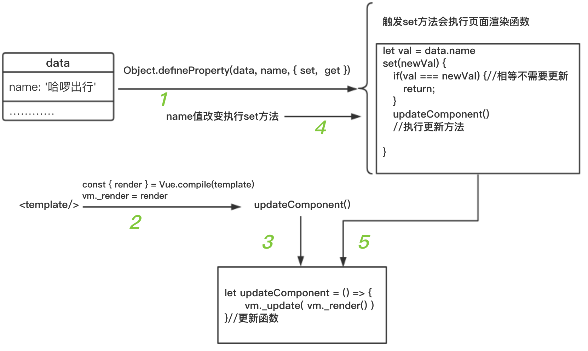
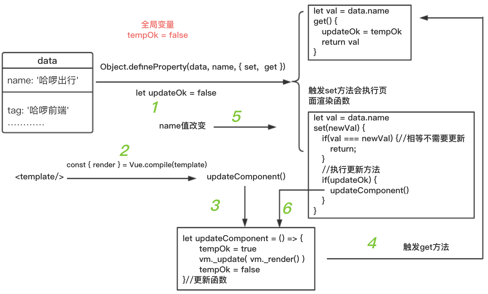
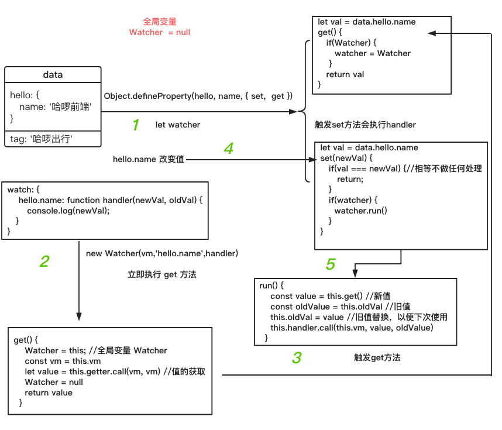
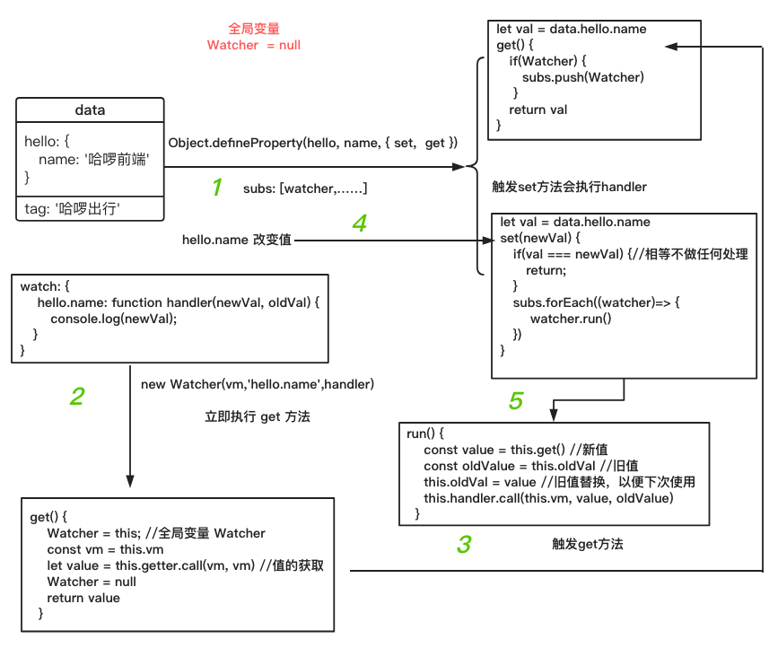
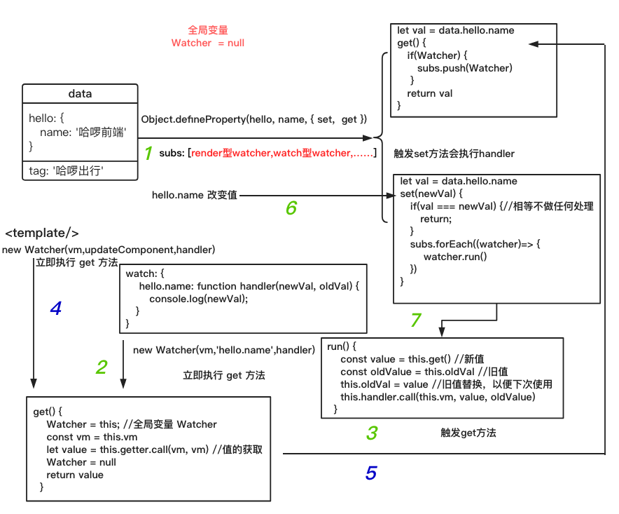
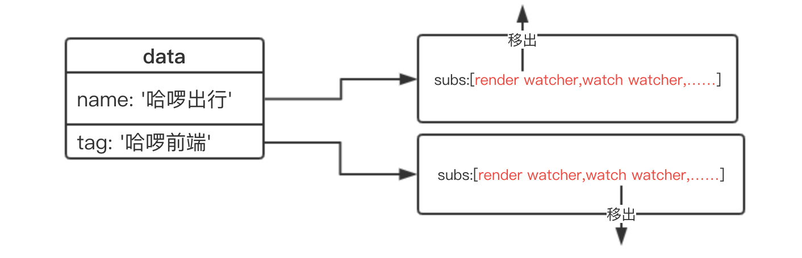
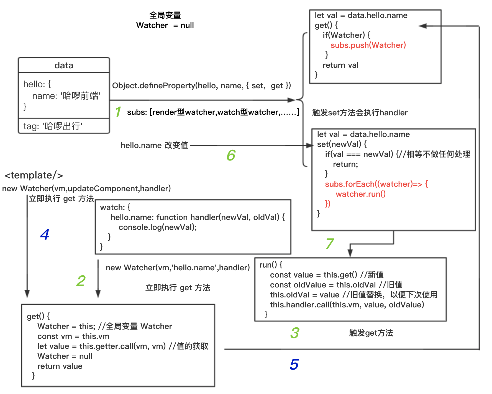
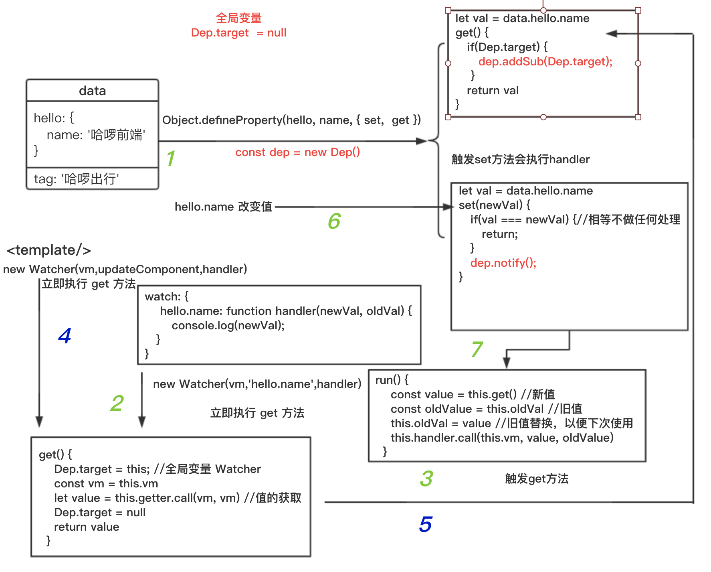
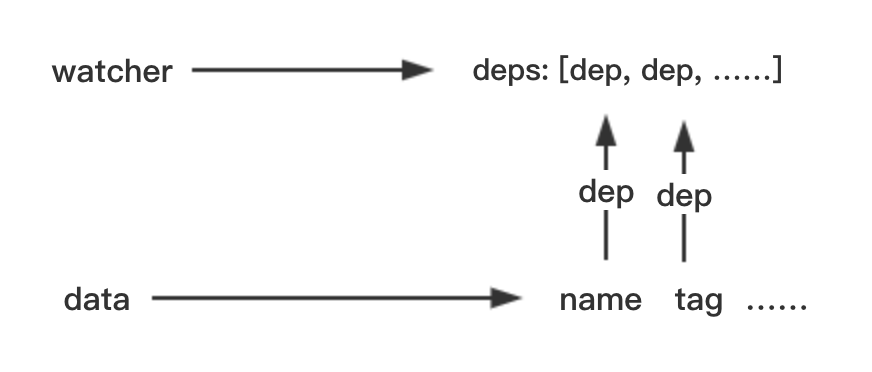
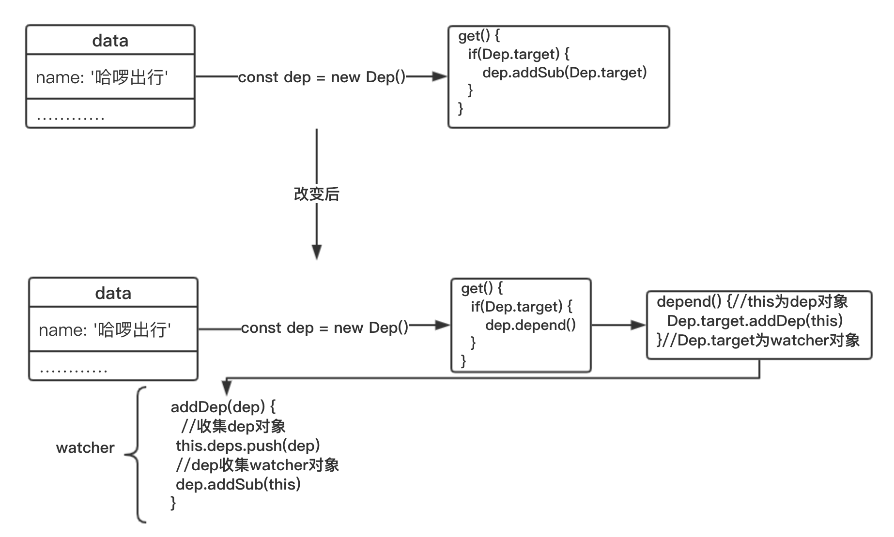

# 响应式原理
<!-- 我并不想一开始就去跟随源码来一步一步的讲解`vue`,原因有以下几点:
- 读者没有了解vue的整个架构，跟随看源码看会云里雾里
- 对源码的讲解，可能自己表达力不够
- 网上分析源码的文章很多 -->
## template 到 DOM
接触 `vue` 框架的开发者都了解，我们有两种方式写 `html`
- 通过 `template` 的方式
- 通过 `render` 函数的方式

如果是通过 `template` 的方式，最终还是要转为 `render` 函数。

::: tip
小提示: `vue` 的版本有几种，如不带编译的版本（无 `template` 转 `render` 函数功能）。我们平时大多使用这种版本，不是因为我们不写 `template`，而是我们的 `template` 都会写在`.vue` 的文件中。而 `.vue` 的文件是通过 `vue-loader` 加载器加载的。`vue-loader` 会提取 `template` 给 `vue-template-compiler` 编译成 `render` 函数。
:::

```html
<div id="app"></app>
```
```js
import Vue from 'vue'
new Vue({
  el: '#app', //寻找创建出来的DOM替换的地方
  template:'<button @click="changeName">{{ name }}</button>' //渲染的模板
  data() {
    return {
      name: '哈啰出行,点我试试!'
    }
  },
  methods: {
    changeName() {
      this.name = '哈啰出行，我看行'
    }
  }
});
```
<comp-1 />
`Vue` 中有个叫 `compile` 的编译函数, 此函数会把 `template` 编译成 `render` 函数，如以下的精简版:
````html
template
<button @click="changeName">{{ name }}</button>
````
````js
const { render } = Vue.compile(template)
vm._render = render
render--> () => {
  return with(this){//如果直接vm._render()执行的话 this就是vm
    return _c('button',
      {
        on:{"click": changeName}
      },
      [
        _v( _s(name) )
      ]
    )
  }
}
````
执行 `vm._render` （函数的执行过程中会获取 `name` 的值，如果定义数据劫持，会触发 `get` 方法）会返回 `vnode`。`vnode` 会传给 `vm._update` 方法更新 `vm.$el`， 而 `vm.$el` 是 `#app` 的引用。
````html
<div id="app"></app>
````
````js
 vm.$el = el = document.querySeletor('#app')
````
所以当我们更改 `vm.$el` 页面就会随之改变， 而 `vm._update` 函数就是改变 `vm.$el`
````js
Vue.prototype._update = function (vnode) {
  const vm = this
  const prevEl = vm.$el
  const prevVnode = vm._vnode
  vm._vnode = vnode
  // Vue.prototype.__patch__ is injected in entry points
  // based on the rendering backend used.
  if (!prevVnode) {
    // 初始化渲染
    vm.$el = vm.__patch__(vm.$el, vnode, false, false /* removeOnly */)
  } else {
    // 更新渲染
    vm.$el = vm.__patch__(prevVnode, vnode)
  }
}
````
这里的 `vm.__patch__` 函数是通过 `diff` 算法对新旧 `vnode` 比较，更新 `$el`。而初始化阶段只是创建 `$el`。具体详情不在这里讨论
#### 现在我们知道只要执行 `vm._update(vm._render())` 页面就会立即更新渲染
我们可以把其封装在一个名叫 `updateComponent` 的函数中
````js
let updateComponent = () => {
  vm._update( vm._render() )
}
````
当每次需要执行页面更新渲染的时候，执行此函数即可。
## `data` 改变重新渲染
初始化的时候会立即执行一次`updateComponent` 函数。当 `data` 值改变时，我们需要重新渲染页面，所以我们要对 `data` 进行数据劫持。当触发其 `set` 方法时, 执行 `updateComponent` 函数。如下流程图所示:

整个初次渲染和更新渲染功能已经完成。不过看如下代码
````html
<span @click="changeName">{{name}}</span>
````
````js
data() {
  return {
    name: '哈啰出行',
    tag: '哈啰前端'
  }
}
````
对于定义在 `data` 里面的变量都会对其进行数据劫持。当去触发 `name` 的 `set` 方法时会更新页面，而当触发 `tag` 的 `set` 方法时也会更新页面。此时的更新页面根本是多余，因为 `template` 模板中没有出现 `tag`。
#### 怎么知道哪些触发 `set` 方法时要更新，哪些不用呢？
我们对数据劫持的变量如 `name` 、 `tag` 等都设置一个属于自己的变量 `updateOK`。在触发变量 `set` 方法时，如果`updateOK` 为 `true` 就执行渲染函数。在页面第一次初始化渲染的时候执行了 `render` 函数。函数的执行会触发所有在 `template` 模板中定义的变量（ `name` 等）的 `get` 方法。在 `get` 方法中我们可以设置 `updateOK=true`。

而在 `get` 方法中直接设置 `updateOK=true` 似乎有问题，如
````js
created() {
  const temp = this.tag;
}
````
尽管 `tag` 在 `render` 函数的过程中没有触发其  `get` 方法，但在 `created` 方法中触发了 `tag` 的 `get` 方法，然而 `tag` 的改变并不需要更新页面。我们需要创建一个全局变量 `tempOk` , `get` 方法中 `updateOK` 变量的值应该跟随全局变量 `tempOk`变动。全局变量 `tempOk` 应该在 `render` 函数执行前后变动。
````js
let val = data.tag
get() {
  updateOk = tempOk
  return val
}
````
````js
let updateComponent = () => {
  tempOk = true
  vm._update( vm._render() )
  tempOk = false
 }//更新函数
````
改变后的流程图

可以发现，只有在 `render` 函数执行期间, `tempOk` 才为 `true`。期间触发 `get` 方法收集的 `updateOk` 变量也都为 `true` , 这样在触发 `set` 方法时才会执行渲染函数渲染页面。

## watch 监听的实现
如下代码
````js
{
  data() {
    return {
      hello: {
        name: '哈啰前端'
      }
    }
  },
  watch: {
    'hello.name': function handler(newVal, oldVal)=> {
      console.log(newVal)
    }
  }
}
````
`watch` 功能是监听当 `hello.name` 的值发生变化的时候执行对应的 `handler` 方法，方法的参数是新旧值。分析功能有以下几点
- `hello.name` 的值变化要执行 `handler` 函数
- 要保存新旧值在 `handler` 函数执行时当参数传入

以下代码是对 `watch` 的 `key` 如 `hello.name` 获取其值的包装函数
````js
function parsePath (path) {
  const segments = path.split('.')
  return function (obj) {
    for (let i = 0; i < segments.length; i++) {
      if (!obj) return
      obj = obj[segments[i]]
    }
    return obj
  }
}
var getter = parsePath(watchKey) //例如 hello.name、a.b.c……
var oldVal = getter.call(vm, vm) //值的获取
````
`parsePath` 函数的功能是返回一个函数如 `getter`，此函数是获取监听表达式的值，而 `obj` 是执行 `getter` 函数所传的参数如 `vm` 。如果传递的参数是 `vm` 那就是在 `vm` 上获取值, 如：
```js
  watchKey: hello.name
  vm = vm.hello  // 触发 hello 的 get 方法
  vm = vm.name   // 触发 name 的 get 方法
  return vm      // *注 vm是引用但这里是=赋值，所以并不会担心改变传递来的 vm 的值
```

再次包装一下获取值的函数，如 `get`
````js
let get = (vm, watchKey)=> {
  let getter = parsePath(watchKey)
  let value = getter.call(vm, vm) //值的获取
  return value
}
````
仅仅只有获取表达式值得方法还不够，我们还需要执行 `handler` 函数的方法，如 `run`
```js
let run = (vm, watchKey, handler)=> {
  const value = get(vm, watchKey)
  handler.call(vm, value, oldValue)
}
```
上面代码缺少 `oldValue` ，我们需要一开始初始化的时候执行 `get` 方法缓存起来 `oldValue`。通过创建一个对象 `watcher` ，此  `watcher` 对于每个 `watchKey` 来说都是唯一的，而且结构都一样，可以通过 `Watcher` 类来创建：
```js{7,8,12,13,16,17,18,19}
let uid = 0
class Watcher {
  constructor (vm, watchKey, handler) {
    this.vm = vm
    this.handler = handler
    this.id = ++uid // watcher对象唯一标识
    this.getter = parsePath(watchKey)
    this.oldVal = this.get() //一开始就获取旧值缓存在watcher对象上
  }
  get() {
    const vm = this.vm
    let value = this.getter.call(vm, vm) //值的获取
    return value
  }
  run() {
    const value = this.get() //新值
    const oldValue = this.oldVal //旧值
    this.oldVal = value //旧值替换，以便下次使用
    this.handler.call(this.vm, value, oldValue)
  }
}
```
`new Watcher(vm, watchKey, handler)` 会直接把 `oldValue` 缓存在 `watcher` 对象上，
那么监听值的改变怎么执行 `watcher.run` 方法呢？

```js{11,14}
let uid = 0
class Watcher {
  constructor (vm, watchKey, handler) {
    this.vm = vm
    this.handler = handler
    this.id = ++uid // watcher对象唯一标识
    this.getter = parsePath(watchKey)
    this.oldVal = this.get() //一开始就获取旧值缓存在watcher对象上
  }
  get() {
    Watcher = this //全局变量Watcher定义成此时的watcher
    const vm = this.vm
    let value = this.getter.call(vm, vm) //值的获取
    Watcher = null //依赖收集完成后置空全局变量Watcher
    return value
  }
  run() {
    const value = this.get() //新值
    const oldValue = this.oldVal //旧值
    this.oldVal = value //旧值替换，以便下次使用
    this.handler.call(this.vm, value, oldValue)
  }
}
```

当获取 `hello.name` 值触发 `get` 方法时，需要在 `get` 方法中收集 `hello.name` 对应的 `watcher` 对象，以便在触发 `set` 方法中直接 `watcher.run()` 执行。我们要把 `watcher` 对象赋值给一个全局变量 `Watcher` 。值获取结束要立即把 `Watcher` 全局变量设置 `null`，因为 `data` 里面定义的其他响应式变量触发 `set` 方法如果判断全局 `Watcher` 有值也会相应执行 `watcher.run()`，这是要避免的

`watch` 的流程图如下

以下代码输出的结果是什么？

````js{14}
{
  data() {
    return {
      hello: {
        name: '哈啰前端'
      }
    }
  },
  watch: {
    'hello.name': function handler1(newVal, oldVal) {
      console.log(newVal)
    },
    hello: function handler2(newVal, oldVal) {
      console.log(newVal)
    }
  },
  mounted() {
    this.hello = '值得改变'
  }
}
````
按照以上所描述的流程图，在解析 `hello.name` 会同时触发 `hello` 的 `get` 方法和 `name` 的 `get` 方法。
此时 `hello` 已经收集了 `hello.name` 创建的 `watcher` 对象。当再次解析 `watch` 中 `hello` 的时候，又会触发 `hello` 的 `get` 方法，重新赋值 `hello` 创建的 `watcher` 对象。所以虽然触发了两次 `get` 方法，但只会收集 `hello` 创建的 `watcher` 对象。最终只执行 `hello` 创建的 `watcher` 对象的 `run` 方法，结果

`值得改变`

很遗憾的是 `Vue` 保留了两者，结果是

`undefined、值得改变`

::: tip
`undefined` 是因为 `this.hello = 值得改变` ，那么 `this.hello.name` 当然是 `undefined`
:::

对于 `watch` 的 `hello` 而言，两个 `watcher.run` 方法都执行了，显然我们需要把 `watcher` 对象放入数组中，而并非替换。 对于每个响应式变量来说，应该创建一个唯一的 `subs` 数组存放收集的 `watcher` 对象。在值改变触发 `set` 方法时，循环执行 `subs` 里面的 `watcher` 对象的 `run` 方法，改变后流程图

### 整合页面渲染 与 watch
再次看下页面渲染流程图

- `watch` 的整个流程是先解析表达式，触发 `get` 收集相关 `watcher` 放入 `subs` 数组中，`set` 方法触发时，循环执行 `watcher`的 `run` 方法 --> 执行 `handler`
- 页面渲染的整个流程似乎也差不多，触发 `get` 收集是否执行更新方法的标识，`set` 方法触发时，执行更新函数

对于渲染页面而言，也可以创建 `watcher` 对象，触发 `get` 收集渲染 `watcher` 放入 `subs` 数组中。然后 `run` 方法 --> 执行渲染函数

试着构造页面渲染的 `watcher`
````js{6,12,16}
let uid = 0
class Watcher {
  constructor (vm, updateComponent) {
    this.vm = vm
    this.id = ++uid // watcher唯一标识
    this.getter = updateComponent
    this.get() //一开始就立即执行渲染函数
  }
  get() {
    Watcher = this; //全局变量 Watcher
    const vm = this.vm
    this.getter.call(vm, vm) //执行updateComponent方法
    Watcher = null
  }
  run() {
    const value = this.get() //再次执行updateComponent渲染更新函数
  }
}
````
由于页面渲染没有 `handler` 方法，为了与 `watch` 的 `watcher` 对象结构一样，对于页面渲染可以在`new Watcher` 的时候传入空函数作为 `handler` 函数
#### render watcher
````js{2,6,22}
let uid = 0
const handler = ()=> {}
class Watcher {
  constructor (vm, updateComponent, handler) {
    this.vm = vm
    this.handler = handler
    this.id = ++uid // watcher唯一标识
    this.getter = updateComponent
    this.oldVal = this.get() //一开始就获取旧值缓存在watcher对象上
  }
  get() {
    Watcher = this; //全局变量 Watcher
    const vm = this.vm
    let value = this.getter.call(vm, vm) //值的获取
    Watcher = null
    return value
  }
  run() {
    const value = this.get() //新值
    const oldValue = this.oldVal //旧值
    this.oldVal = value //旧值替换，以便下次使用
    this.handler.call(this.vm, value, oldValue)
  }
}
````
#### 再看看 watch watcher
```js
let uid = 0
class Watcher {
  constructor (vm, watchKey, handler) {
    this.vm = vm
    this.handler = handler
    this.id = ++uid // watcher对象唯一标识
    this.getter = parsePath(watchKey)
    this.oldVal = this.get() //一开始就获取旧值缓存在watcher对象上
  }
  get() {
    Watcher = this //全局变量Watcher定义成此时的watcher
    const vm = this.vm
    let value = this.getter.call(vm, vm) //值的获取
    Watcher = null //依赖收集完成后置空全局变量Watcher
    return value
  }
  run() {
    const value = this.get() //新值
    const oldValue = this.oldVal //旧值
    this.oldVal = value //旧值替换，以便下次使用
    this.handler.call(this.vm, value, oldValue)
  }
}
```
仔细观察发现，`watch` 和 `render` (渲染) 的 `watcher` 只有 `this.getter` 函数的获取是不一样了，可以根据是否为函数来判断，整合之后的 `watcher` 如下
```js{7,8,9,10,11}
let uid = 0
class Watcher {
  constructor (vm, expOrFn, handler) {
    this.vm = vm
    this.handler = handler
    this.id = ++uid // watcher唯一标识
    if (typeof expOrFn === 'function') {
      this.getter = expOrFn
    } else {
      this.getter = parsePath(expOrFn)
    }
    this.oldVal = this.get() //一开始就获取旧值缓存在watcher对象上
  }
  get() {
    Watcher = this; //全局变量 Watcher
    const vm = this.vm
    let value = this.getter.call(vm, vm) //值的获取
    Watcher = null
    return value
  }
  run() {
    const value = this.get() //新值
    const oldValue = this.oldVal //旧值
    this.oldVal = value //旧值替换，以便下次使用
    this.handler.call(this.vm, value, oldValue)
  }
}
```
渲染函数和 `watch` 共存的流程图


### 销毁定义的 watcher 对象
为什么要销毁 `watcher` 对象？因为在程序开发过程中，有可能我们不需要再监听 `data` 值了，或者不需要页面再次响应式更新页面了。大家可以查看，`vue` 在生命周期 `destroyed` 阶段就是这样做的，所以我们需要有销毁 `watcher` 对象这样的功能。销毁也就是把相应的类型 `watcher` 从 `data` 的 `subs`数组中移出来：

我们可以在 `data` 创建 `subs` 数组的时候，创建删除 `watcher` 对象的函数，如 `removeSub` 。因为对于每一个 `data` 里面的响应式数据而言，他们都需要 `subs` 、`removeSub`，所以我们可以通过一个类 `Dep` 来创建
```js
function remove (arr, item) {
  if (arr.length) {
    const index = arr.indexOf(item)
    if (index > -1) {
      return arr.splice(index, 1)
    }
  }
}
let uid = 0
class Dep {
  constructor () {
    this.id = uid++;//dep 对象的唯一标识
    this.subs = [];//存放 watcher 对象的数组
  }
  removeSub (watcher) {//删除 watcher 对象函数
    remove(this.subs, watcher);
  }
}
```
再次看看之前的流程图：

注意红色区域，之前是直接在触发 `data` 响应式数据的 `get` 方法中直接 `subs.push(Watcher)`。现在我们需要通过创建函数 `addSub`，之前是通过遍历 `subs` 数组执行 `watcher.run` 方法，现在我们可以创建函数 `notify`，之前是创建全局变量 `Watcher`，现在可以用 `Dep.target` 替代，如：
```js
class Dep {
  constructor () {
    this.id = uid++;//dep 对象的唯一标识
    this.subs = [];//存放 watcher 对象的数组
  }
  addSub (watcher) { // 增加 watcher 对象函数
    this.subs.push(watcher)
  }
  removeSub (watcher) {//删除 watcher 对象函数
    remove(this.subs, watcher);
  }
  notify () {
    // stabilize the subscriber list first
    const subs = this.subs.slice()
    for (let i = 0, l = subs.length; i < l; i++) {
      subs[i].run()
    }
  }
}
Dep.target = null//全局变量。默认为null
```
我们看看更改后的流程图：

回到之前的问题，我们要销毁一个 `watcher`，就必须知道，这个 `watcher` 存在于哪些 `data` 数据的 `subs` 数组中，也就是哪些 `dep` 对象，然后执行这些 `dep` 对象的 `removeSub` 方法删除这个 `watcher`。 首先在 `Watcher` 类上创建一个常量数组 `deps` 用于存放收集自己被哪些 `dep` 对象收集了，再创建销毁函数 `teardown`，如下：

```js{6,17}
let uid = 0
class Watcher {
  constructor (vm, expOrFn, handler) {
    this.vm = vm
    this.active = true // 控制在销毁期间不能再次销毁
    this.deps = [] // 收集dep对象
    …………
  }
  …………
  teardown () { // watcher销毁函数
    if (this.active) {
      // remove self from vm's watcher list
      // this is a somewhat expensive operation so we skip it
      // if the vm is being destroyed.
      let i = this.deps.length
      while (i--) {
        this.deps[i].removeSub(this)
      }
      this.active = false
    }
  }
}
```
所以我们不仅要在 `dep` 对象中收集 `watcher` 对象，还要在 `watcher` 对象中收集 `dep` 对象，看图：

终于收集到了 `dep` 对象了，也知道此 `watcher` 对象被哪些 `dep` 对象收集了。
#### Dep 类
```js
class Dep {
  constructor () {
    this.id = uid++;//dep 对象的唯一标识
    this.subs = [];//存放 watcher 对象的数组
  }
  addSub (watcher) { // 增加 watcher 对象函数
    this.subs.push(watcher)
  }
  removeSub (watcher) {//删除 watcher 对象函数
    remove(this.subs, watcher);
  }
  depend () {
    if (Dep.target) {
      Dep.target.addDep(this)// this是dep实例对象
    }
  }
  notify () {
    // stabilize the subscriber list first
    const subs = this.subs.slice()
    for (let i = 0, l = subs.length; i < l; i++) {
      subs[i].run()
    }
  }
}
Dep.target = null//全局变量。默认为null
```
#### Watcher 类
```js
let uid = 0
class Watcher {
  constructor (vm, expOrFn, handler) {
    this.vm = vm
    this.active = true // 控制在销毁期间不能再次销毁
    this.deps = [] // 收集dep对象
    this.handler = handler
    this.id = ++uid // watcher唯一标识
    if (typeof expOrFn === 'function') {
      this.getter = expOrFn
    } else {
      this.getter = parsePath(expOrFn)
    }
    this.oldVal = this.get() //一开始就获取旧值缓存在watcher对象上
  }
  get() {
    Dep.target = this; //全局变量 Watcher
    const vm = this.vm
    let value = this.getter.call(vm, vm) //值的获取
    Dep.target = null
    return value
  }
  /**
  * Add a dependency to this directive.
  */
  addDep(dep) {
    this.deps.push(dep) //收集dep对象
    dep.addSub(this) //dep 收集watcher对象
  }
  run() {
    const value = this.get() //新值
    const oldValue = this.oldVal //旧值
    this.oldVal = value //旧值替换，以便下次使用
    this.handler.call(this.vm, value, oldValue)
  }
  teardown() { // watcher销毁函数
    if (this.active) {
      // remove self from vm's watcher list
      // this is a somewhat expensive operation so we skip it
      // if the vm is being destroyed.
      let i = this.deps.length
      while (i--) {
        this.deps[i].removeSub(this)
      }
      this.active = false
    }
  }
}
```
再次看看这个图

初始化的时候，触发了 `watcher` 的 `get` 方法，相关 `data` 响应式数据收集到了 `watcher` 对象。当响应式数据发生变化，执行 `run` 函数的时候又会去执行 `get` 方法。使得响应式数据重复收集 `watcher`。所以要在 `addDep` 方法中去重，我们可以创建一个 `set` 类型数组，存放 `dep` 对象的 `id`，通过 `dep` 对象的 `id` 去重。
```js{6,16}
let uid = 0
class Watcher {
  constructor (vm, expOrFn, handler) {
    …………
    this.active = true // 控制在销毁期间不能再次销毁
    this.depIds = new Set()
    this.deps = [] // 收集dep对象
    …………
  }
  …………
  /**
  * Add a dependency to this directive.
  */
  addDep(dep) {
    const id = dep.id
    if (!this.depIds.has(id)) {//去重
      this.depIds.add(id) //add id
      this.deps.push(dep) //收集dep对象
      dep.addSub(this) //dep 收集watcher对象
    }
  }
  …………
}
```
上面去重代码，完美解决更新之后的再次触发重复收集和页面多个相同响应式变量对 `watcher` 的重复收集，因为 `name` 的 `dep.id` 是一样的，如
```html
<div>
  <span>{{name}}</span>
  <input v-model="name"/>
</div>
```
但还是会有问题，我们看如下代码
```html
<div>
  <div v-if="show">{{name}}</div>
  <div v-else>{{tag}}</div>
</div>
```
当 `show` 为 `true` 的时候，页面收集 `render watcher` 的响应式数据变量是 `show` 和 `name`。而当 `show` 为 `false` 的时候，页面收集 `render watcher` 的响应式数据变量变为 `show` 和 `tag`。然而 `name` 之前已经收集了 `render watcher`，`name` 值得改变依然会触发页面更新，虽然此时页面上已经没有 `name` 了，所以我们需要去掉 `name` 的 `render watcher`。

假设我们有两个箱子，一个箱子 `deps` 装的是旧的响应式数据对应的`render watcher`如 `show  name`的。一个箱子 `newDeps` 装的是新的响应式数据对应的 `render watcher` 如 `show  tag` 的。每一次 `watcher` 收集都是装在新箱子，收集完后新箱子与旧箱子比较，删除旧箱子里面不存在与新箱子里的 `render watcher`。然后旧箱子设置为新箱子的内容，新箱子置空，等待下一次的 `watcher` 收集赋值。
```js{4,5,16}
addDep (dep) {
  const id = dep.id
  if (!this.newDepIds.has(id)) { //去重
    this.newDepIds.add(id) // 装入新箱子
    this.newDeps.push(dep)
    if (!this.depIds.has(id)) {
      dep.addSub(this) //dep 收集watcher对象
    }
  }
}
get() {
  Dep.target = this; //全局变量 Watcher
  const vm = this.vm
  let value = this.getter.call(vm, vm) //值的获取
  Dep.target = null
  this.cleanupDeps() //收集结束后的新旧箱子操作
  return value
}
/**
  * Clean up for dependency collection.
  */
cleanupDeps () {
  let i = this.deps.length
  while (i--) {//去除像 name 这样的在新箱子中没有的
    const dep = this.deps[i]
    if (!this.newDepIds.has(dep.id)) {
      dep.removeSub(this)
    }
  }
  //以下是旧箱子设置为新箱子的内容，新箱子置空操作
  let tmp = this.depIds
  this.depIds = this.newDepIds
  this.newDepIds = tmp
  this.newDepIds.clear()
  tmp = this.deps
  this.deps = this.newDeps
  this.newDeps = tmp
  this.newDeps.length = 0
}
```
#### 改变后的 Watcher 类
```js{7}
let uid = 0
class Watcher {
  constructor (vm, expOrFn, handler) {
    this.vm = vm
    this.active = true // 控制在销毁watcher期间不能再次销毁
    this.deps = [] // 收集旧dep对象
    this.newDeps = [] // 收集新dep对象
    this.depIds = new Set() //去重作用
    this.newDepIds = new Set() //去重作用
    this.handler = handler
    this.id = ++uid // watcher唯一标识
    if (typeof expOrFn === 'function') {
      this.getter = expOrFn
    } else {
      this.getter = parsePath(expOrFn)
    }
    this.oldVal = this.get() //一开始就获取旧值缓存在watcher对象上
  }
  get() {
    Dep.target = this; //全局变量 Watcher
    const vm = this.vm
    let value = this.getter.call(vm, vm) //值的获取
    Dep.target = null
    this.cleanupDeps() //收集结束后的新旧箱子操作
    return value
  }
  /**
  * Add a dependency to this directive.
  */
  addDep (dep) {
    const id = dep.id
    if (!this.newDepIds.has(id)) { //去重
      this.newDepIds.add(id) // 装入新箱子
      this.newDeps.push(dep)
      if (!this.depIds.has(id)) {
        dep.addSub(this) //dep 收集watcher对象
      }
    }
  }
  /**
  * Clean up for dependency collection.
  */
  cleanupDeps () {
    let i = this.deps.length
    while (i--) {//去除像 name 这样的在新箱子中没有的
      const dep = this.deps[i]
      if (!this.newDepIds.has(dep.id)) {
        dep.removeSub(this)
      }
    }
    //以下是旧箱子设置为新箱子的内容，新箱子置空操作
    let tmp = this.depIds
    this.depIds = this.newDepIds
    this.newDepIds = tmp
    this.newDepIds.clear()
    tmp = this.deps
    this.deps = this.newDeps
    this.newDeps = tmp
    this.newDeps.length = 0
  }
  run() { //执行更新函数
    const value = this.get() //新值
    const oldValue = this.oldVal //旧值
    this.oldVal = value //旧值替换，以便下次使用
    this.handler.call(this.vm, value, oldValue)
  }
  teardown() { // watcher销毁函数
    if (this.active) {
      // remove self from vm's watcher list
      // this is a somewhat expensive operation so we skip it
      // if the vm is being destroyed.
      let i = this.deps.length
      while (i--) {
        this.deps[i].removeSub(this)
      }
      this.active = false
    }
  }
}
```
查看 `watch api` 可以了解到，`watch` 还有一些配置项如 `immediate、deep` 这里我先讲解 `deep` 原理。`immediate` 可以在 `API` 系列中的 `$watch` 中查看

`deep` 的意思就是深度监听，比如定义一个响应式对象 `hello`
```js
{
  data() {
    return {
      hello: {child: '哈啰前端'}
    }
  },
  watch: {
    hello: {
      handler: function(val, oldVal) {/*…………*/},
      deep: true
    }
  }
}
```
如果定义了配置项 `deep` ，不仅需要监听 `hello` 值的变化，`child` 值的变化也需要监听
::: tip
`watch` 根据功能的不同会有很多种写法，[官网链接](https://cn.vuejs.org/v2/api/#watch)，但最终解析后会通过 `new Watcher` 创建
:::
我们需要传入配置项比如 `options`
```js{6,7,8,9,10,24,25,26}
let uid = 0
class Watcher {
  constructor (vm, expOrFn, handler, options) {
    this.vm = vm
    // options
    if (options) {
      this.deep = !!options.deep
    } else {
      this.deep = false
    }
    this.handler = handler
    this.id = ++uid // watcher唯一标识
    if (typeof expOrFn === 'function') {
      this.getter = expOrFn
    } else {
      this.getter = parsePath(expOrFn)
    }
    this.oldVal = this.get() //一开始就获取旧值缓存在watcher对象上
  }
  get() {
    Watcher = this; //全局变量 Watcher
    const vm = this.vm
    let value = this.getter.call(vm, vm) //值的获取
    if (this.deep) { //深度监听 watch
      traverse(value)
    }
    Watcher = null
    return value
  }
  run() {
    const value = this.get() //新值
    const oldValue = this.oldVal //旧值
    this.oldVal = value //旧值替换，以便下次使用
    this.handler.call(this.vm, value, oldValue)
  }
}
```
我们明白之所以 `hello` 值的变化会执行 `handler` 函数是因为我们主动去触发 `hello` 的 `get` 方法，然后让其 `subs` 去收集 `watch watcher` 对象。如果我们需要深度监听，就应该让 `hello` 里面的 `child` 的 `subs` 也收集 `watch watcher` 对象，所以我们需要去主动触发 `child` 的 `get` 方法，也就是取值

我们创建函数 `traverse`
```js{2,3}
export function traverse (val) {
  const isA = Array.isArray(val)
  if ((!isA && !isObject(val)) || Object.isFrozen(val) || val instanceof VNode) {
    return
  }
}
```
`val` 的值必须应该是数组或者对象才应该对其进行深度监听，否则是没有意义的（如 `hello:123`），当然冻结对象和 `vnode` 不能监听。接下来我们要触发取值了，但是 `val` 是数组或者对象（数组或者对象子集还可能是数组或者对象），我们需要递归操作
```js
export function traverse (val) {
  let i, keys
  const isA = Array.isArray(val)
  if ((!isA && !isObject(val)) || Object.isFrozen(val) || val instanceof VNode) {
    return
  }
  const getVal= val //触发值的 get 方法收集 watch watcher对象
  if (isA) {//数组
    i = val.length
    while (i--) traverse(val[i])
  } else {//对象
    keys = Object.keys(val)
    i = keys.length
    while (i--) traverse(val[keys[i]])
  }
}
```
直接取值似乎不行，我们需要判断 `val` 是不是响应式变量（ `vue` 中响应式变量都会有 `__ob__` 值），我们对于每一个响应式变量创建的 `dep` 对象就放在 `__ob__` 值上。
```js
if(val.__ob__) {//说明是响应式变量
  const getVal= val
}
```
但是我们不想重复去触发 `val` 的 `get` 方法，所以我们可以通过 `dep.id` 来避免重复触发取值
```js{1,8,9,10,11,12,13,14,15}
const seen = new Set()
export function traverse (val,seen) {
  let i, keys
  const isA = Array.isArray(val)
  if ((!isA && !isObject(val)) || Object.isFrozen(val) || val instanceof VNode) {
    return
  }
  if (val.__ob__) {//说明是响应式变量
    //触发值的 get 方法收集 watch watcher对象，获取其 id 放入 set 中，避免重复触发
    const depId = val.__ob__.dep.id 
    if (seen.has(depId)) {//判断是否已经重复触发了
      return
    }
    seen.add(depId)
  }
  if (isA) {//数组
    i = val.length
    while (i--) traverse(val[i], seen)
  } else {//对象
    keys = Object.keys(val)
    i = keys.length
    while (i--) traverse(val[keys[i]], seen)
  }
}
```
`set` 类型的 `seen` 是公用的，所以执行完 `traverse` 方法后，需要重置，改变后的代码
```js{9}
const seenObjects = new Set()
/**
 * Recursively traverse an object to evoke all converted
 * getters, so that every nested property inside the object
 * is collected as a "deep" dependency.
 */
export function traverse (val) {
  _traverse(val, seenObjects)
  seenObjects.clear()
}
function _traverse (val, seen) {
  let i, keys
  const isA = Array.isArray(val)
  if ((!isA && !isObject(val)) || Object.isFrozen(val) || val instanceof VNode) {
    return
  }
  if (val.__ob__) {
    const depId = val.__ob__.dep.id
    if (seen.has(depId)) {
      return
    }
    seen.add(depId)
  }
  if (isA) {
    i = val.length
    while (i--) _traverse(val[i], seen)
  } else {
    keys = Object.keys(val)
    i = keys.length
    while (i--) _traverse(val[keys[i]], seen)
  }
}
```
回到 `Watcher` 类，为了能更容易的查看当前实例已经创建了哪些 `watcher` ，我们可以在创建 `watcher` 对象的时候存放在实例的 `_watchers` 数组中，如果是渲染函数的 `watcher`，可以额外放入实例的 `_watcher` 变量上
```js{5,6,7,8}
let uid = 0
class Watcher {
  constructor (vm, expOrFn, handler, options, isRenderWatcher) {
    this.vm = vm
    if (isRenderWatcher) { // 如果是渲染函数的观察者（对于整个页面的依赖收集）
      vm._watcher = this
    }
    vm._watchers.push(this)
    // options
    if (options) {
      this.deep = !!options.deep
    } else {
      this.deep = false
    }
    this.handler = handler
    this.id = ++uid // watcher唯一标识
    if (typeof expOrFn === 'function') {
      this.getter = expOrFn
    } else {
      this.getter = parsePath(expOrFn)
    }
    this.oldVal = this.get() //一开始就获取旧值缓存在watcher对象上
  }
  get() {
    Watcher = this; //全局变量 Watcher
    const vm = this.vm
    let value = this.getter.call(vm, vm) //值的获取
    if (this.deep) { //深度监听 watch
      traverse(value)
    }
    Watcher = null
    return value
  }
  run() {
    const value = this.get() //新值
    const oldValue = this.oldVal //旧值
    this.oldVal = value //旧值替换，以便下次使用
    this.handler.call(this.vm, value, oldValue)
  }
}
```
## computed 计算属性
看如下代码
```js
{
  data() {
    return {
      name: '哈啰出行'
    }
  },
  computed: {
    hello1() { //只有get写法
      return this.name
    },
    hello2: { //get和set写法
      get() {
        return this.name
      },
      set(newV) {
        this.name = newV
      }
    }
  }
}
```
分析一下计算属性的功能
- 可以设置，执行 `set` 方法（如果定义了 `set` 方法）
- 可以获取其值，执行 `get` 方法（没有响应式属性依赖值变化时，`get` 方法只会执行一次，下次取值会返回缓存值）
- `get` 方法中如果有响应式属性依赖（如：this.name）值的改变，下次获取值会重新执行 `get` 方法返回新值，不会返回缓存值

以上面的代码为例，首先需要获取 `computed` 对象，我们创建函数 `initComputed` 初始化计算属性。定义计算属性有两种方式，我们需要分别解析
```js
function initComputed (vm, computed) {
  for (const key in computed) {//遍历获取key 如hello1、hello2
    const userDef = computed[key] //获取实体
    if (!(key in vm)) {//不能和实例中(如：data、props等)的其他属性重名
      defineComputed(vm, key, userDef)
    }else {
      //警告信息，重名,代码省略
    }
  }
}
const sharedPropertyDefinition = {
  enumerable: true, //可枚举
  configurable: true, //可配置
  get: noop, // noop-->()=> {}空函数
  set: noop
}
function defineComputed (target,key,userDef) {
  if (typeof userDef === 'function') { // 说明只有get方法，hello1的书写方式
    sharedPropertyDefinition.get = userDef
    sharedPropertyDefinition.set = noop //noop为空函数 ()=> {}，没有定义set方法
  }else {//在对象中获取 get set 方法，hello2的书写方式
    sharedPropertyDefinition.get = userDef.get
    sharedPropertyDefinition.set = userDef.set || noop
  }
  //通过defineProperty来劫持数据
  Object.defineProperty(target, key, sharedPropertyDefinition)
}
```
通过 `Object.defineProperty` 给计算属性代理 `set` `get` 方法，实现了取值和设置值。我们还有以下问题没有解决：
- 执行一次 `get` 方法后，需要缓存返回值，下次直接返回缓存值
- 如果有响应式属性依赖值改变，再次取值需要重新执行 `get` 方法，不能返回缓存值

如果我们创建计算属性类型的 `watcher` 对象，`watcher` 对象的表达式就是计算属性的 `get` 方法，那么 `new Watcher` 的时候返回值就会缓存在 `watcher.oldVal` 上，下次取值就直接返回缓存值 `watcher.oldVal`。

我们需要对每个计算属性创建一个属于自己的 `watcher` 对象，这些 `watcher` 对象可以存放在实例的 `_computedWatchers` 对象中，方便以后使用。创建 `watcher` 对象，我们需要先获取到计算属性的 `get` 方法，作为 `Watcher` 类的第二个参数
```js{3,6,7,8,9,10,11}
function initComputed (vm, computed) {
  // 存放computed watcher
  const watchers = vm._computedWatchers = Object.create(null) 
  for (const key in computed) {//遍历获取key 如hello1、hello2
    const userDef = computed[key] //获取实体
    const getter = typeof userDef === 'function' ? userDef : userDef.get
    watchers[key] = new Watcher( // 创建 watcher 存入watchers对象中 
      vm,
      getter || noop,
      noop
    )
    if (!(key in vm)) {//不能和实例中的其他属性重名
      defineComputed(vm, key, userDef)
    }else {
      //警告信息，重名,代码省略
    }
  }
}
```
再次看看 `Watcher` 类的部分代码
```js{7,8,12,17}
let uid = 0
class Watcher {
  constructor (vm, expOrFn, handler, options, isRenderWatcher) {
    this.vm = vm
    …………
    this.id = ++uid // watcher唯一标识
    if (typeof expOrFn === 'function') {
      this.getter = expOrFn // 计算属性的 get 方法
    } else {
      this.getter = parsePath(expOrFn)
    }
    this.oldVal = this.get() //一开始就获取旧值缓存在watcher对象上
  }
  get() {
    Dep.target = this; //全局变量 Watcher
    const vm = this.vm
    let value = this.getter.call(vm, vm) //值的获取
    Dep.target = null
    this.cleanupDeps() //收集结束后的新旧箱子操作
    return value
  }
  …………
  run() { //执行更新函数
    const value = this.get() //新值
    const oldValue = this.oldVal //旧值
    this.oldVal = value //旧值替换，以便下次使用
    this.handler.call(this.vm, value, oldValue)
  }
  …………
}
```
在 `new Watcher` 的时候就直接执行了计算属性的 `get` 方法，并且把方法的返回值赋在了 `watcher` 对象的 `oldVal` 上。再次改变下 `defineComputed` 方法
```js{3,6,12,16}
function defineComputed (target,key,userDef) {
  if (typeof userDef === 'function') { // 说明只有get方法，hello1的书写方式
    sharedPropertyDefinition.get = createComputedGetter(key)
    sharedPropertyDefinition.set = noop //noop为空函数 ()=> {}
  }else {//在对象中获取 get set 方法，hello2的书写方式
    sharedPropertyDefinition.get = createComputedGetter(key)
    sharedPropertyDefinition.set = userDef.set || noop
  }
  //通过defineProperty来劫持数据
  Object.defineProperty(target, key, sharedPropertyDefinition)
}
function createComputedGetter (key) {
  return function computedGetter () {
    const watcher = this._computedWatchers && this._computedWatchers[key]
    if (watcher) {
      return watcher.oldVal //返回计算属性的 get 方法 return 值
    }
  }
}
```
当我们初始化计算属性的时候，会 `new Watcher`。所有的计算属性都会执行一遍自己定义的 `get` 方法，把返回值缓存在 `watcher` 对象的 `oldVal` 上。当我们获取计算属性的值时，如 this.hello1、this.hello2，实际上是执行 `computedGetter` 方法返回缓存值 `oldVal`

看如下代码
```js
{
  computed: {
    hello() {
      console.log('执行了get方法')
      return 111
    }
  }
}
```
按照上面所说的，初始化的时候就会执行计算属性的 `get` 方法，然而结果并没有打印 `执行了get方法`。所以初始化的时候虽然 `new Watcher` 但在 `watcher` 内部没有执行 `get` 方法，想想也对，计算属性立即执行 `get` 方法并没有什么作用。我们可以增加配置，`lazy` 控制是否需要立即执行 `get` 方法
```js{2,13}
// 并不会在创建watcher的时候立即执行get方法获取value
const computedWatcherOptions = { lazy: true }
function initComputed (vm, computed) {
  // 存放computed watcher
  const watchers = vm._computedWatchers = Object.create(null) 
  for (const key in computed) {//遍历获取key 如hello1、hello2
    const userDef = computed[key] //获取实体
    const getter = typeof userDef === 'function' ? userDef : userDef.get
    watchers[key] = new Watcher( // 创建 watcher 存入watchers对象中 
      vm,
      getter || noop,
      noop,
      computedWatcherOptions
    )
    if (!(key in vm)) {//不能和实例中的其他属性重名
      defineComputed(vm, key, userDef)
    }else {
      //警告信息，重名,代码省略
    }
  }
}
```
```js{8,9,10,11,18,19,20}
let uid = 0
class Watcher {
  constructor (vm, expOrFn, handler, options, isRenderWatcher) {
    this.vm = vm
    …………
    // options
    if (options) {
      this.lazy = !!options.lazy
    } else {
      this.lazy = false
    }
    this.id = ++uid // watcher唯一标识
    if (typeof expOrFn === 'function') {
      this.getter = expOrFn // 计算属性的 get 方法
    } else {
      this.getter = parsePath(expOrFn)
    }
    this.oldVal = this.lazy
      ? undefined
      : this.get() //一开始就获取旧值缓存在watcher对象上
  }
  get() {
    Dep.target = this; //全局变量 Watcher
    const vm = this.vm
    let value = this.getter.call(vm, vm) //值的获取
    Dep.target = null
    this.cleanupDeps() //收集结束后的新旧箱子操作
    return value
  }
  …………
  run() { //执行更新函数
    const value = this.get() //新值
    const oldValue = this.oldVal //旧值
    this.oldVal = value //旧值替换，以便下次使用
    this.handler.call(this.vm, value, oldValue)
  }
  …………
}
```
既然初始化计算属性的时候并没有执行 `get` 方法，此时的 `watcher.oldVal` 依然是 `undefined`。所以第一次去获取计算属性值的时候需要触发 `get` 方法， `createComputedGetter` 函数需要改变
```js{5}
function createComputedGetter (key) {
  return function computedGetter () {
    const watcher = this._computedWatchers && this._computedWatchers[key]
    if (watcher) {
      watcher.evaluate() //在 watcher中执行 get 缓存值赋值 oldVal
      return watcher.oldVal //返回计算属性的 get 方法 return 值
    }
  }
}
```
当然我们不能每次取值都去执行 `watcher.evaluate()` ，那样就没有缓存效果了
```js{16,17,18}
function defineComputed (target,key,userDef) {
  if (typeof userDef === 'function') { // 说明只有get方法，hello1的书写方式
    sharedPropertyDefinition.get = createComputedGetter(key)
    sharedPropertyDefinition.set = noop //noop为空函数 ()=> {}
  }else {//在对象中获取 get set 方法，hello2的书写方式
    sharedPropertyDefinition.get = createComputedGetter(key)
    sharedPropertyDefinition.set = userDef.set || noop
  }
  //通过defineProperty来劫持数据
  Object.defineProperty(target, key, sharedPropertyDefinition)
}
function createComputedGetter (key) {
  return function computedGetter () {
    const watcher = this._computedWatchers && this._computedWatchers[key]
    if (watcher) {
      if (watcher.dirty) { //dirty控制只执行一遍
        watcher.evaluate() //在 watcher中执行 get
      }
      return watcher.oldVal //返回计算属性的 get 方法 return 值
    }
  }
}
```
```js{12,35,36,37,38}
let uid = 0
class Watcher {
  constructor (vm, expOrFn, handler, options, isRenderWatcher) {
    this.vm = vm
    …………
    // options
    if (options) {
      this.lazy = !!options.lazy
    } else {
      this.lazy = false
    }
    this.dirty = this.lazy
    this.id = ++uid // watcher唯一标识
    if (typeof expOrFn === 'function') {
      this.getter = expOrFn // 计算属性的 get 方法
    } else {
      this.getter = parsePath(expOrFn)
    }
    this.oldVal = this.lazy
      ? undefined
      : this.get() //一开始就获取旧值缓存在watcher对象上
  }
  get() {
    Dep.target = this; //全局变量 Watcher
    const vm = this.vm
    let value = this.getter.call(vm, vm) //值的获取
    Dep.target = null
    this.cleanupDeps() //收集结束后的新旧箱子操作
    return value
  }
  /**
  * Evaluate the value of the watcher.
  * This only gets called for lazy watchers.
  */
  evaluate () {
    this.oldVal = this.get()
    this.dirty = false // 控制只执行一遍 evaluate
  }
  …………
}
```
第一次获取计算属性值的时候，由于 `dirty=true` 我们执行了 `evaluate` 方法 --> `get()、dirty=false` ，返回值缓存在了 `watcher.oldVal` 上。当下次获取计算属性值的时候由于 `dirty=false` 所以直接返回缓存值 `watcher.oldVal`。
- ~~执行一次 `get` 方法后，需要缓存返回值，下次直接返回缓存值~~
- 如果有响应式属性依赖值改变，再次取值需要重新执行 `get` 方法，不能返回缓存值

如果在响应式属性依赖值改变的时候，能把 `computed watcher` 的 `dirty` 值设置为 `true`，那么再次取值就需要重新执行 `get` 方法，不会返回缓存值了。我们知道在执行 `evaluate` 方法的时候，所有计算属性的依赖都收集到了 `computed watcher`。当这些依赖值改变的时候，会触发 `computed watcher` 的 `run` 方法，我们可以在这里设置 `dirty` 的值（注 `lazy=true` 才是计算属性的 `watcher`）

查找 `vue` 的源码发现 `Watcher` 类里面的 `run` 方法是这样写的，通过 `update` 方法处理了下
```js{13,15,16}
class Watcher {
  constructor (vm, expOrFn, handler, options, isRenderWatcher) {
    …………
    // options
    if (options) {
      this.lazy = !!options.lazy
    } else {
      this.lazy = false
    }
    this.dirty = this.lazy
    …………
  }
  update () {
    /* istanbul ignore else */
    if (this.lazy) { // 计算属性的 watcher lazy 为 true 根本不会执行 run 方法
      this.dirty = true
    } else {
      this.run()
    }
  }
  run() {
    const value = this.get() //新值
    const oldValue = this.oldVal //旧值
    this.oldVal = value //旧值替换，以便下次使用
    this.handler.call(this.vm, value, oldValue)
  }
  evaluate () {
    this.oldVal = this.get()
    this.dirty = false // 控制只执行一遍 evaluate
  }
  …………
}
```
虽然计算属性的响应式依赖收集了 `computed watcher`，但依赖值改变时并不会执行 `watcher.run` 方法，也就是并不会去执行计算属性的 `get` 方法，它只是把 `dirty=true`，下次取值就要重新执行 `get` 获取新值了
- ~~执行一次 `get` 方法后，需要缓存返回值，下次直接返回缓存值~~
- ~~如果有响应式属性依赖值改变，再次取值需要重新执行 `get` 方法，不能返回缓存值~~

有人可能会提出疑问，计算属性不是依赖值改变了就会重新执行一遍计算属性方法吗？

当然不是，我们先想想，当 `template` 中定义了计算属性，计算属性响应式依赖值（并没有定义在 `template` 中）的改变为什么会重新渲染页面？
```html
<div>{{hello}}</div>
```
```js
{
  data() {
    return {
      name: '哈啰前端'
    }
  },
  created() {
    setTimeout(()=> {
      this.name = '值的改变'
    },3000)
  },
  computed: {
    hello() {
      return this.name
    }
  }
}
```
结果是页面先显示 `哈啰前端` 三秒后变成了 `值的改变`。虽然 `name` 并未在 `template` 中出现，但 `name` 值的改变确实执行了 `render watcher` 的 `run` 方法，实现页面更新渲染。`template` 在初始化的时候会触发计算属性 `hello` 的包装方法 `computedGetter`
```js
function createComputedGetter (key) {
  return function computedGetter () {
    const watcher = this._computedWatchers && this._computedWatchers[key]
    if (watcher) {
      if (watcher.dirty) { //dirty控制只执行一遍
        watcher.evaluate() //在 watcher中执行 get
      }
      return watcher.oldVal //返回计算属性的 get 方法 return 值
    }
  }
}
```
由于 `computedGetter` 是 `template` 取值触发的，此时的 `Dep.target` 应该是 `render watcher`。如果我们在 `computedGetter` 执行了 `watcher.evaluate`，会重新赋值 `Dep.target`，导致 `template` 收集的 `watcher` 是不正确的，但执行 `watcher.evaluate`，还必须赋值 `Dep.target` 是 `computed watcher`。解决方式是使用栈的方式存储赋值 `Dep.target`，上代码
#### Watcher 类相关代码
```js{6,9}
class Watcher {
  constructor (vm, expOrFn, handler, options, isRenderWatcher) {
    …………
  }
  get() {
    pushTarget(this)
    const vm = this.vm
    let value = this.getter.call(vm, vm) //值的获取
    popTarget()
    this.cleanupDeps() //收集结束后的新旧箱子操作
    return value
  }
  …………
  run() { //执行更新函数
    const value = this.get() //新值
    const oldValue = this.oldVal //旧值
    this.oldVal = value //旧值替换，以便下次使用
    this.handler.call(this.vm, value, oldValue)
  }
  …………
}
```
#### Dep 类相关代码
```js{9,10,14}
class Dep {
  constructor () {
    this.id = uid++;//dep 对象的唯一标识
    this.subs = [];//存放 watcher 对象的数组
  }
  …………
}
Dep.target = null//全局变量。默认为null
const targetStack = []
export function pushTarget (target) {
  targetStack.push(target)
  Dep.target = target
}
export function popTarget () {
  targetStack.pop()
  Dep.target = targetStack[targetStack.length - 1]
}
```
通过栈的先进先出，`template` 取值触发的时候 `render watcher` 入栈，`Dep.target` 是 `render watcher` 。`watcher.evaluate` 执行期间 `computed watcher` 入栈 `Dep.target` 是 `computed watcher` 。执行结束后 `computed watcher` 出栈。此时 `Dep.target` 那应该是 `render watcher` 。我们需要把此计算属性的响应式依赖的 `subs` 数组全部加入 `render watcher`。
```js{8,9,10}
function createComputedGetter (key) {
  return function computedGetter () {
    const watcher = this._computedWatchers && this._computedWatchers[key]
    if (watcher) {
      if (watcher.dirty) { //dirty控制只执行一遍
        watcher.evaluate() //在 watcher中执行 get
      }
      if (Dep.target) { // renderWatcher(如果有的话)
        watcher.depend()
      }
      return watcher.oldVal //返回计算属性的 get 方法 return 值
    }
  }
}
```
在 `Watcher` 类中加入 `depend` 方法，主动让计算属性的依赖收集 `render watcher`
#### Watcher 类相关代码
```js{9,10,11,12,13,14,18}
class Watcher {
  constructor (vm, expOrFn, handler, options, isRenderWatcher) {
    …………
  }
  …………
  /**
    * Depend on all deps collected by this watcher.
    */
  depend () {
    let i = this.deps.length
    while (i--) {
      this.deps[i].depend()
    }
  }
  /**
  * Add a dependency to this directive.
  */
  addDep (dep) {
    const id = dep.id
    if (!this.newDepIds.has(id)) { //去重
      this.newDepIds.add(id) // 装入新箱子
      this.newDeps.push(dep)
      if (!this.depIds.has(id)) {
        dep.addSub(this) //dep 收集watcher对象
      }
    }
  }
}
```
#### Dep 类相关代码
```js{7,8,9,10,11}
class Dep {
  constructor () {
    this.id = uid++;//dep 对象的唯一标识
    this.subs = [];//存放 watcher 对象的数组
  }
  …………
  depend () {
    if (Dep.target) {
      Dep.target.addDep(this)// this是dep实例对象
    }
  }
  …………
}
```
如果 `template` 模板中定义了此计算属性，此计算属性里面的响应式依赖不仅收集了 `computed watcher`，而且还收集了 `render watcher`。那么我们细想一下，既然这些响应式依赖收集了 `render watcher`，那么在依赖值发生变化的时候会重新渲染页面，`template` 会再一次的获取计算属性的值执行其 `computedGetter` 方法。
```js{5}
function createComputedGetter (key) {
  return function computedGetter () {
    const watcher = this._computedWatchers && this._computedWatchers[key]
    if (watcher) {
      if (watcher.dirty) { //dirty控制只执行一遍
        watcher.evaluate() //在 watcher中执行 get
      }
      if (Dep.target) { // renderWatcher(如果有的话)
        watcher.depend()
      }
      return watcher.oldVal //返回计算属性的 get 方法 return 值
    }
  }
}
```
是直接返回缓存值还是重新执行 `get` 值，`watcher.dirty` 至关重要。还记得如下代码吗
```js{13,15,16}
class Watcher {
  constructor (vm, expOrFn, handler, options, isRenderWatcher) {
    …………
    // options
    if (options) {
      this.lazy = !!options.lazy
    } else {
      this.lazy = false
    }
    this.dirty = this.lazy
    …………
  }
  update () {
    /* istanbul ignore else */
    if (this.lazy) { // 计算属性的 watcher lazy 为 true 根本不会执行 run 方法
      this.dirty = true //这里设置 true 就是让下次执行 get 而非返回缓存值
    } else {
      this.run()
    }
  }
  evaluate () {
    this.oldVal = this.get()
    this.dirty = false // 控制只执行一遍 evaluate
  }
  run() {
    const value = this.get() //新值
    const oldValue = this.oldVal //旧值
    this.oldVal = value //旧值替换，以便下次使用
    this.handler.call(this.vm, value, oldValue)
  }
  …………
}
```
~~计算属性不是依赖值改变了就会重新执行一遍计算属性方法吗？~~

也许你在 `template` 中定义了计算属性，才会出现这种假象
#### 总结
- 计算属性的响应式依赖值的改变，并不会去执行计算属性的 `get` 方法。它只会改变下次取值不返回缓存值而是重新计算值返回
- 如果 `template` 定义了计算属性，计算属性的响应式依赖会收集 `render watcher`。依赖值得改变会重新渲染页面，使得计算属性又一次执行
## nextTick 原理
我们明白，当改变响应式变量的值时，会执行 `subs` 数组里面的 `watcher.run` 方法。我们看看下面代码会带来什么后果
```html
<div>{{name}}</div>
```
```js
data() {
  return {
    name: '哈啰前端'
  }
},
watch: {
  name(newval, oldVal) {
    console.log(newval)
  }
},
created() {
  for(let i=0;i<10000;i+=1) {
    this.name = i;
  }
}
```
很明显，他会触发一万次 `name` 的 `set` 方法 --> `[watch watcher, render watcher]`，执行一万次 `watch handler` 和页面渲染，这样绝对是不被允许的。我们应该只执行一次 `watch watcher` 和 `render watcher`，获取最新 `name` 值就可以了。我们知道 `js` 主程序是先于微任务或者宏任务执行完成的，如
```js
created() {
  for(let i=0;i<10000;i+=1) {
    this.name = i;
  }
  const p = Promise.resolve()
  p.then(()=> {
    /*watcher.run*/
  })
}
```
`for` 是先于 `Promise` 执行完，我们应该在 `Promise` 中执行 `watcher.run`，在这里获取到的 `name` 值是最新值，我们创建 `queueWatcher` 函数，在这里进行异步处理
```js{10}
class Watcher {
  constructor (vm, expOrFn, handler, options, isRenderWatcher) {
    …………
  }
  update () {
    /* istanbul ignore else */
    if (this.lazy) { // 计算属性的 watcher lazy 为 true 根本不会执行 run 方法
      this.dirty = true //这里设置 true 就是让下次执行 get 而非返回缓存值
    } else { //异步处理
      this.queueWatcher(this)
    }
  }
  …………
}
```
我们应该把各种类型的 `watcher` 放入数组中，然后在异步代码中（如 `promise` ）中轮询执行 `watcher.run`
```js{5,11}
const queue = []
const p = Promise.resolve()
function nextTick() {
  p.then(()=> {
    queue.forEach((watcher)=> {
      watcher.run()
    })
  })
}
export function queueWatcher(watcher) {
  queue.push(watcher)
  nextTick()
}
```
`then` 里面的函数应该创建 `flushSchedulerQueue` 函数代替比较好
```js{6,7,8,9,10,13}
const queue = []
const p = Promise.resolve()
function nextTick(fn) {
  p.then(fn)
}
function flushSchedulerQueue() {
  queue.forEach((watcher)=> {
    watcher.run()
  })
}
export function queueWatcher(watcher) {
  queue.push(watcher)
  nextTick(flushSchedulerQueue)
}
```
每次执行 `queueWatcher` 都会执行 `nextTick` ，这个要做处理。我们创建 `waiting` ，只有当上一次 `nextTick` 执行完后才能执行下一个 `nextTick`
```js{2,8,12,13}
const queue = []
let waiting = false //控制nextTick没执行完，不能执行下一个nextTick
function flushSchedulerQueue() {
  queue.forEach((watcher)=> {
    watcher.run()
  })
  //设置回初始状态
  waiting = false
}
export function queueWatcher(watcher) {
  queue.push(watcher)
  if(!waiting) {
    waiting = true
    nextTick(flushSchedulerQueue)
  }
}
```
一万次的执行，会 `push` 相同 `watcher` 一万次，所以还要做去重处理，当一次 `nextTick` 执行完，需要做设置回初始状态
```js{3,10,14,15}
const queue = []
let waiting = false //控制nextTick没执行完，不能执行下一个nextTick
let has = {}
function flushSchedulerQueue() {
  queue.forEach((watcher)=> {
    watcher.run()
  })
  //设置回初始状态
  waiting = false
  has = {}
}
export function queueWatcher(watcher) {
  const id = watcher.id
  if (has[id] == null) {//通过 watcher.id 去重处理
    has[id] = true
    queue.push(watcher)
    if(!waiting) {
      waiting = true
      nextTick(flushSchedulerQueue)
    }
  }
}
```
以上代码解决了执行一万次这样的问题，不过还有优化的空间。我们现在的 `queue` 数组中存放着各种类型的 `watcher` (如：`render、watch、computed`)，我们是否要对其按照 `watcher.id` 的大小排序呢？
先创建的 `watcher` 放前面？
```js
queue.sort((a, b) => a.id - b.id) //watcher的id越小,放在数组前面
```
`Vue` 源码给出了几点答案
- Components are updated from parent to child. (because parent is always created before the child)
- If a component is destroyed during a parent component's watcher run, its watchers can be skipped
- A component's user watchers are run before its render watcher (because user watchers are created before the render watcher)
 
- 组件的渲染顺序是父组件 --> 子组件，父组件先执行（`watcher.id` 小于子组件的 `watcher.id`），那么相应的 `queue` 数组中应该父组件的 `watcher` 先于子组件的 `watcher` 执行。
- 父组件的 `watcher run` 执行过程中（如 watch 监听执行 `handler` 函数），可能会有销毁子组件的操作。如果子组件的 `watcher` 放 `queue` 前面就会执行浪费，因为它已经销毁
- 我们知道 `watch computed` 的 `watcher` 是先于 `render watcher` 创建的，如果 `render watcher` 最后执行有什么好处？

可能有这样的场景
```html
<div>{{name}} {{tag}}</div>
```
```js
{
  data() {
    return {
      name: '哈啰前端',
      tag: '哈啰出行'
    }
  },
  watch: {
    name(newVal, oldVal) {
      this.tag = '值的改变'
    }
  },
  created() {
    for(let i=0;i<10000,i++) {
      this.name = i
    }
  }
}
```
如果 `render watcher` 先执行，页面渲染后应该是
`10000 哈啰出行`，然后执行 `watch watcher` 再次触发页面渲染，最后页面结果是 `10000 值的改变`

如果先执行 `watch watcher`，此时的 `tag` 值已经是 `值的改变`，然后执行 `render watcher` 触发页面渲染，页面结果是 `10000 值的改变`

虽然最后页面展示的结果都一样，但谁的性能更好一目了然，当然我们还要保证遍历执行的顺序应该和 `queue` 数组里的顺序一致，使用 `for` 替代 `forEach`，修改的代码如下
```js{5,7,8,9,10}
const queue = []
let waiting = false //控制nextTick没执行完，不能执行下一个nextTick
let has = {}
function flushSchedulerQueue() {
  let watcher
  queue.sort((a, b) => a.id - b.id)
  for(let index=0, j=queue.length; i<j; i++) {
    watcher = queue[index]
    watcher.run()
  }
  //设置回初始状态
  waiting = false
  has = {}
}
export function queueWatcher(watcher) {
  const id = watcher.id
  if (has[id] == null) {//通过 watcher.id 去重处理
    has[id] = true
    queue.push(watcher)
    if(!waiting) {
      waiting = true
      nextTick(flushSchedulerQueue)
    }
  }
}
```
在 `nextTick` 里面执行 `flushSchedulerQueue` 函数是异步的，那么就有可能在执行`flushSchedulerQueue` 函数的过程中，又有 `queueWatcher(watcher)` 执行了，该怎么办？

这是个特殊情况，我们首先要知道 `flushSchedulerQueue` 函数是否已经执行完毕，在执行过程中应该有特殊的处理。创建 `flushing` 变量来标识是否是执行过程中状态
```js{3,6,12,19,20,21,22,23}
const queue = []
let waiting = false //控制nextTick没执行完，不能执行下一个nextTick
let flushing = false //默认是非执行过程中状态
let has = {}
function flushSchedulerQueue() {
  flushing = true // 执行过程中
  let watcher
  queue.sort((a, b) => a.id - b.id)
  for(let index=0, j=queue.length; i<j; i++) {
    watcher = queue[index]
    watcher.run()
  }
  //设置回初始状态
  waiting = flushing = false
  has = {}
}
export function queueWatcher(watcher) {
  const id = watcher.id
  if (has[id] == null) {//通过 watcher.id 去重处理
    has[id] = true
    if (!flushing) { // flushSchedulerQueue 函数非执行过程中状态，直接push
      queue.push(watcher)
    } else {
      //执行过程中状态的处理
    }
    if(!waiting) {
      waiting = true
      nextTick(flushSchedulerQueue)
    }
  }
}
```
首先我们需要明确一点，执行过程中状态，我们也需要把此时传进来的 `watcher` 放入数组中，让其可以通过循环执行掉。但是`flushSchedulerQueue` 函数里面的循环执行完毕后才会重置状态 `has={}`。那么新进来的 `watcher` 假如和循环中已经执行完的`watcher`是相同的，就会被去重代码排除在外，因此 `flushSchedulerQueue` 函数里面的循环体需要改变下，执行完后的 `watcher` 需要立即重置状态 `has[id] = null`
```js{3,7,8}
function flushSchedulerQueue() {
  flushing = true // 执行过程中
  let watcher,id
  queue.sort((a, b) => a.id - b.id)
  for(let index=0, j=queue.length; i<j; i++) {
    watcher = queue[index]
    id = watcher.id
    has[id] = null
    watcher.run()
  }
  //设置回初始状态
  waiting = flushing = false
  has = {}
}
```
执行过程中状态，`queue` 的长度是变化的，所以 `flushSchedulerQueue` 函数里面的循环需要小小改动下，每次遍历都需要重新去取 `queue` 的长度
```js{1}
for(let index=0; i<queue.length; i++) {
  watcher = queue[index]
  id = watcher.id
  has[id] = null
  watcher.run()
}
```
我们不应该忘记，`queue` 数组里面的 `watcher` 都是排序的，所以在执行过程中状态下，进来的 `watcher` 也需要排序，首先需要知道 `queue` 数组中最后一个 `watcher` 的 `id` 是多少
```js
let i = queue.length - 1
queue[i].id
```
保证排序顺序插入 `queue` 数组中
```js{7,8,9,10,11,12,13}
export function queueWatcher(watcher) {
  const id = watcher.id
  if (has[id] == null) {//通过 watcher.id 去重处理
    has[id] = true
    if (!flushing) { // flushSchedulerQueue 函数非执行过程中状态，直接push
      queue.push(watcher)
    } else {//执行过程中状态的处理
      let i = queue.length - 1
      while (queue[i].id > watcher.id) {
        i--
      }
      queue.splice(i + 1, 0, watcher)
    }
    if(!waiting) {
      waiting = true
      nextTick(flushSchedulerQueue)
    }
  }
}
```
当然我们需要知道执行过程中，到底已经执行到什么位置了，要保证新来的 `watcher` 放入的位置在已经执行位置的后面，不然循环就不会执行新来的 `watcher`。先要知道已经执行到什么位置了
```js{1,6,13}
let index = 0
function flushSchedulerQueue() {
  flushing = true // 执行过程中
  let watcher,id
  queue.sort((a, b) => a.id - b.id)
  for(index=0, j=queue.length; i<j; i++) {
    watcher = queue[index]
    id = watcher.id
    has[id] = null
    watcher.run()
  }
  //设置回初始状态
  index = queue.length = 0 //也要把 queue 置空
  waiting = flushing = false
  has = {}
}
```
看看 `queueWatcher` 怎么修改的
```js{10,11,12,13}
export function queueWatcher (watcher) {
  const id = watcher.id
  if (has[id] == null) {
    has[id] = true
    if (!flushing) {
      queue.push(watcher)
    } else { // 需要watcer排序插入到queue中
      // if already flushing, splice the watcher based on its id
      // if already past its id, it will be run next immediately.
      let i = queue.length - 1
      while (i > index && queue[i].id > watcher.id) {
        i--
      }
      queue.splice(i + 1, 0, watcher)
    }
    // queue the flush
    if (!waiting) {
      waiting = true
      nextTick(flushSchedulerQueue)
    }
  }
}
```
把 `flushSchedulerQueue` 函数里面重置状态部分放入函数里面管理，更改后的代码如下
```js
const queue = []
let has = {}
let waiting = false
let flushing = false
let index = 0
/**
 * Reset the scheduler's state.
 */
function resetSchedulerState () {
  index = queue.length = 0
  has = {}
  waiting = flushing = false
}
/**
 * Flush both queues and run the watchers.
 */
function flushSchedulerQueue () {
  flushing = true
  let watcher, id

  // Sort queue before flush.
  // This ensures that:
  // 1. Components are updated from parent to child. (because parent is always
  //    created before the child)
  // 2. A component's user watchers are run before its render watcher (because
  //    user watchers are created before the render watcher)
  // 3. If a component is destroyed during a parent component's watcher run,
  //    its watchers can be skipped.  watcher的id越小放在数组前面
  queue.sort((a, b) => a.id - b.id)
  // do not cache length because more watchers might be pushed
  // as we run existing watchers
  for (index = 0; index < queue.length; index++) {
    watcher = queue[index]
    id = watcher.id
    has[id] = null
    watcher.run()
  }
  //重置状态
  resetSchedulerState()
}
/**
 * Push a watcher into the watcher queue.
 * Jobs with duplicate IDs will be skipped unless it's
 * pushed when the queue is being flushed.
 */
export function queueWatcher (watcher) {
  const id = watcher.id
  if (has[id] == null) {
    has[id] = true
    if (!flushing) {
      queue.push(watcher)
    } else { // 需要watcer排序插入到queue中
      // if already flushing, splice the watcher based on its id
      // if already past its id, it will be run next immediately.
      let i = queue.length - 1
      while (i > index && queue[i].id > watcher.id) {
        i--
      }
      queue.splice(i + 1, 0, watcher)
    }
    // queue the flush
    if (!waiting) {
      waiting = true
      nextTick(flushSchedulerQueue)
    }
  }
}
```
以上代码是解决一些应用中的实际问题，通过一些问题来引出 `nextTick` ，我们再来看看 `nextTick` 代码
```js
const p = Promise.resolve()
function nextTick(fn) {
  p.then(fn)
}
```
我们稍微改变下
```js
const p = Promise.resolve()
let timerFunc = (fn) => {
  p.then(fn)
}
function nextTick(fn) {
  timerFunc(fn)
}
```
::: tip
提示：$nextTick 是 nextTick 包装出来的
:::
```js
Vue.prototype.$nextTick = function (fn) {
  return nextTick(fn, this)
}
```
我们看如下场景
```js
mounted() {
  this.name = 'updated'
  const cb = ()=> {
    //这里可以获取到最新更新结果信息
  }
  this.$nextTick(cb)
}
```
这样的代码在我们开发过程中经常会写的，`name` 值的改变触发 `queueWatcher(watcher)` --> `nextTick(fn)`，然后我们又执行了 `nextTick(cb)`。我们希望 `cb` 在 `fn` 执行完后执行，这样在 `cb` 中就可以获取最新信息了，直接存入 `callbacks` 数组中循环执行。直接上代码
```js{1,12}
const callbacks = []// 存放fn的数组
function flushCallbacks () { // 依次执行fn list
  for (let i = 0; i < callbacks.length; i++) {
    callbacks[i]()
  }
}
const p = Promise.resolve()
let timerFunc = () => {
  p.then(flushCallbacks)
}
export function nextTick (cb, ctx) {
  callbacks.push(() => {
    if (cb) {
      cb.call(ctx)
    }
  })
  timerFunc()
}
```
我们希望一次 `timerFunc` 执行完毕后，才能再次执行 `timerFunc` （创建微任务或者宏任务）。
```js{2,4,19,20,21,22}
const callbacks = []// 存放fn的数组
let pending = false// 是否在等待执行fn
function flushCallbacks () { // 依次执行fn list
  pending = false// 不需要等待了
  for (let i = 0; i < callbacks.length; i++) {
    callbacks[i]()
  }
}
const p = Promise.resolve()
let timerFunc = () => {
  p.then(flushCallbacks)
}
export function nextTick (cb, ctx) {
  callbacks.push(() => {
    if (cb) {
      cb.call(ctx)
    }
  })
  if (!pending) {
    pending = true
    timerFunc()
  }
}
```
异步执行 `timerFunc` 的过程中，也有可能会有 `nextTick(cb)` 执行，所以在执行 `timerFunc`，要把 `callbacks` 置空，来装入新来的 `cb`。等待下一次的 `timerFunc` 执行
```js{5,6,7}
const callbacks = []// 存放fn的数组
let pending = false// 是否在等待执行fn
function flushCallbacks () { // 依次执行fn list
  pending = false// 不需要等待了
  const copies = callbacks.slice(0)
  callbacks.length = 0 //置空 callbacks
  for (let i = 0; i < copies.length; i++) {
    callbacks[i]()
  }
}
const p = Promise.resolve()
let timerFunc = () => {
  p.then(flushCallbacks)
}
export function nextTick (cb, ctx) {
  callbacks.push(() => {
    if (cb) {
      cb.call(ctx)
    }
  })
  if (!pending) {
    pending = true
    timerFunc()
  }
}
```
`nextTick` 的原理已经讲解完毕，`timerFunc` 默认是 `Promise`。可能有些浏览器不支持 `Promise` 所以需要优雅的降级，上代码
```js {18,40,51,59}
export const inBrowser = typeof window !== 'undefined'
export const UA = inBrowser && window.navigator.userAgent.toLowerCase()
export const isIE = UA && /msie|trident/.test(UA) //是否是IE环境
export const isIOS = (UA && /iphone|ipad|ipod|ios/.test(UA)) //是否IOS环境
export let isUsingMicroTask = false// 是否正使用微任务
let timerFunc // 用来触发执行回调函数

/* istanbul ignore next */
export function isNative (Ctor) { //宿主是否支持,或者是否原生
  return typeof Ctor === 'function' && /native code/.test(Ctor.toString())
}

//
if (typeof Promise !== 'undefined' && isNative(Promise)) {
  const p = Promise.resolve()
  timerFunc = () => {
    p.then(flushCallbacks)
    // Promsie 微任务，最佳选择
    // In problematic UIWebViews, Promise.then doesn't completely break, but
    // it can get stuck in a weird state where callbacks are pushed into the
    // microtask queue but the queue isn't being flushed, until the browser
    // needs to do some other work, e.g. handle a timer. Therefore we can
    // "force" the microtask queue to be flushed by adding an empty timer.
    if (isIOS) setTimeout(()=>{})
  }
  isUsingMicroTask = true
} else if (!isIE && typeof MutationObserver !== 'undefined' && (
  isNative(MutationObserver) ||
  // PhantomJS and iOS 7.x
  MutationObserver.toString() === '[object MutationObserverConstructor]'
)) {
  // Use MutationObserver where native Promise is not available,
  // e.g. PhantomJS, iOS7, Android 4.4
  // (#6466 MutationObserver is unreliable in IE11)
  let counter = 1
  const observer = new MutationObserver(flushCallbacks)
  // MutationObserver是HTML5中的新API，是用来监视DOM变动的接口。
  // 他能监听一个DOM对象上发生的子节点删除、属性修改、文本内容修改等等。
  // 一旦发现有变动，就会执行传入的flushCallbacks函数，
  //由于其是微任务，在宿主不支持 Promise的时候，其是最佳选择
  const textNode = document.createTextNode(String(counter))
  observer.observe(textNode, {
    characterData: true // 说明监听文本内容的修改。
  })
  timerFunc = () => {
    counter = (counter + 1) % 2
    textNode.data = String(counter)
  }
  isUsingMicroTask = true
} else if (typeof setImmediate !== 'undefined' && isNative(setImmediate)) { 
  // 虽然其是宏任务，但也比 setTimeout 好
  // Fallback to setImmediate.
  // Techinically it leverages the (macro) task queue,
  // but it is still a better choice than setTimeout.
  timerFunc = () => {
    setImmediate(flushCallbacks)
  }
} else {
  //宏任务，最差选择
  timerFunc = () => { 
    setTimeout(flushCallbacks, 0)
  }
}
```
为什么极力希望 `timerFunc` 里面执行优先选择微任务，有以下几点
- 按执行顺序来看，微任务优先宏任务执行
- 宏任务与宏任务之间会执行UI渲染：宏任务（js主程序） -->（所有微任务）UI渲染 --> 宏任务 ……

附上一篇文章 [Tasks, microtasks, queues and schedules](https://jakearchibald.com/2015/tasks-microtasks-queues-and-schedules/?utm_source=html5weekly)


