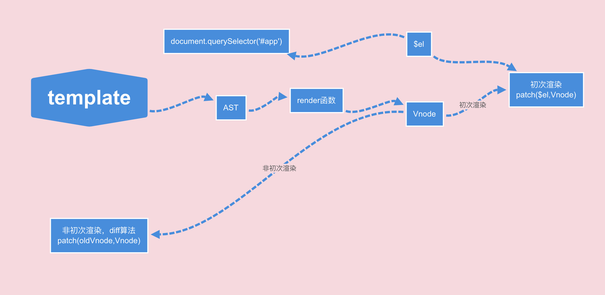

# 定义的 `template` 到底经历了什么？
```html
<div id="app"></div>
```
```js
import Vue from 'vue'
new Vue({
  //el: '#app'
  template: '<div @click="clickDiv"><input class="className1" :class="className2" v-model="inputValue" /></div>',
})
.mount('#app');
```

#### 我们看看源码


## render 函数写法
上面的 `template` 用 `render` 函数怎么写
```html
<div @click="clickDiv">
  <input class="className1" :class="className2" v-model="inputValue" />
</div>
```
[render 函数写法，官网链接](https://cn.vuejs.org/v2/guide/render-function.html)
```js
new Vue({
  data() {
    return {
      inputValue: null
    }
  },
  render: function (createElement) {
    const that = this
    return createElement('div',
      {
        on: {
          click: this.clickDiv
        }
      },
      [
        createElement('input', {
          staticClass: 'className1',
          class: this.className2,
          domProps: {
            'value': this.inputValue
          },
          on: {
            input: function ($event) {
              if ($event.target.composing) return// 正在输入期间
              that.inputValue = $event.target.value
            }
          }
        }),
        createElement('span', this.inputValue)
      ]
    )
  },
});
```
## `template` 转换成 `render` 函数
```js
function() {
  with(this){
    return _c('div',
    {
      on:{"click":clickDiv}
    },[
      _c('input',
      {
        directives:[
          {
            name:"model",
            rawName:"v-model",
            value:(inputValue),
            expression:"inputValue"
          }
        ],
        staticClass:"className1",
        class:className2,
        domProps:{"value":(inputValue)},
        on:{
          "input":function($event){
            if($event.target.composing)return;
            inputValue=$event.target.value
          }
        }
      })
    ])
  }
}
```
#### 不管我们是写 `template` 还是写 `render` 函数，最终都要转换成 `render` 的格式

#### 都听说过虚拟节点吧？它其实就发生在接下来的步骤中
```js
  vm.render()
  render --> 执行render函数--> vnode
```
#### 看看虚拟节点的大致构造
```js
vnode: {
  tag;
  data;
  children;
  text;
  elm;
  key;
  parent; // component placeholder node
  ……
}
```
#### 接下来我们要把 vnode 渲染成真正的 html
```js
vm._update -->  vm.$el = vm.__patch__(prevVnode, vnode)
```
### 先看看简化版的 vm.__patch__
[diff算法解析](https://juejin.im/post/5da6fcb6f265da5b794f2828)
```js
function patch (oldVnode, vnode, hydrating, removeOnly) {
    if (isUndef(vnode)) {
      if (isDef(oldVnode)) invokeDestroyHook(oldVnode)
      return
    }
    const insertedVnodeQueue = []
    if (isUndef(oldVnode)) {//没有定义旧节点
      createElm(vnode, insertedVnodeQueue)
    } else {
      // nodeType为1是元素节点，2是属性节点，3文本节点
      const isRealElement = isDef(oldVnode.nodeType)// 是元素还是vnode
      if (!isRealElement && sameVnode(oldVnode, vnode)) {
        //diff算法--发现不同点-->updateChildren-->createElm
        patchVnode(oldVnode, vnode, insertedVnodeQueue, null, null, removeOnly)
      } else {
        if(isRealElement) {
          oldVnode = emptyNodeAt(oldVnode)
        }
        // replacing existing element
        const oldElm = oldVnode.elm// 之前元素
        const parentElm = nodeOps.parentNode(oldElm)
        createElm(
          vnode,
          insertedVnodeQueue,
          parentElm,
          nodeOps.nextSibling(oldElm)
        )
        // destroy old node
        if (isDef(parentElm)) {
          removeVnodes([oldVnode], 0, 0)
        } else if (isDef(oldVnode.tag)) {
          invokeDestroyHook(oldVnode)
        }
      }
    }

    invokeInsertHook(vnode, insertedVnodeQueue, isInitialPatch)
    return vnode.elm
  }
```
```js
function createElm (
  vnode,
  insertedVnodeQueue,
  parentElm,
  refElm
) {
  const children = vnode.children
  const tag = vnode.tag
  //
  if(isDef(tag)) {//如果定义了 html 标签
    vnode.elm = nodeOps.createElement(tag, vnode)
    //如果有孩子
    createChildren(vnode, children, insertedVnodeQueue)
    //
    insert(parentElm, vnode.elm, refElm)
  }else if (isTrue(vnode.isComment)) {//注释
    vnode.elm = nodeOps.createComment(vnode.text)
    insert(parentElm, vnode.elm, refElm)
  } else {//简单文本
    vnode.elm = nodeOps.createTextNode(vnode.text)
    insert(parentElm, vnode.elm, refElm)
  }
  
}
```
```js
function createChildren (vnode, children, insertedVnodeQueue) {
  if (Array.isArray(children)) {
    if (process.env.NODE_ENV !== 'production') {
      checkDuplicateKeys(children)// 这里是发出警告，如果在同一层级(children)定义的key是一样的
    }
    for (let i = 0; i < children.length; ++i) {
      // 递归遍历children，然后执行createElm
      createElm(children[i], insertedVnodeQueue, vnode.elm, null, true, children, i)
    }
  } else if (isPrimitive(vnode.text)) { // 如果文本节点是string、number、boolean、symbol的类型，直接向子集插入文本节点
    nodeOps.appendChild(vnode.elm, nodeOps.createTextNode(String(vnode.text)))
  }
}
export function createElement (tagName, vnode) {
  const elm = document.createElement(tagName)
  if (tagName !== 'select') {
    return elm
  }
  // false or null will remove the attribute but undefined will not
  // 除非没有定义multiple，也即是vnode.data.attrs.multiple===undefined，否则都会加上multiple=multiple属性
  if (vnode.data && vnode.data.attrs && vnode.data.attrs.multiple !== undefined) {
    elm.setAttribute('multiple', 'multiple')
  }
  return elm
}

function insert (parent, elm, ref) {
  if (isDef(parent)) {
    if (isDef(ref)) {
      if (nodeOps.parentNode(ref) === parent) {
        // ref原本就是vnode的nextSibling(下一个同级元素)，为了不影响插入的顺序，使用了insertBefore
        nodeOps.insertBefore(parent, elm, ref)
      }
    } else {
      nodeOps.appendChild(parent, elm)
    }
  }
}

export function createTextNode (text) {
  return document.createTextNode(text)
}

export function createComment (text) {
  return document.createComment(text)
}

export function insertBefore (parentNode, newNode, referenceNode) {
  parentNode.insertBefore(newNode, referenceNode)
}

export function removeChild (node, child) {
  node.removeChild(child)
}

export function appendChild (node, child) {
  node.appendChild(child)
}

export function parentNode (node) {
  return node.parentNode
}

export function nextSibling (node) {
  return node.nextSibling
}

export function tagName (node) {
  return node.tagName
}

export function setTextContent (node, text) {
  node.textContent = text
}

export function setStyleScope (node, scopeId) {
  node.setAttribute(scopeId, '')
}
```
